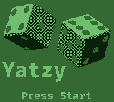
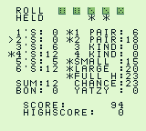

# Yatzy-GB

A version of the dice game Yatzy for the Nintendo Game Boy




## Running

A pre-built ROM is available in the ![releases][1] tab.

Yatzy-GB has run in all Gameboy/Gameboy Color emulators I've tested as well as
on real hardware using flash cartridges. 32KB flash cartridges without an MBC
work, though to save highscores a flash cartridge with external RAM is needed -
carts with MBC1, 2, 3 and 5 should all work in theory, though I've only tested
[this][2] 512KB MBC5 cart from insideGadgets.

If you do run into any problems, feel free to make an issue.

## Rules & Controls

**DPAD**	- Move the cursor (the `>` character)

**A**		- Press a button/Score a category/Toggle whether a die is held

**B**		- Return to Menu (from the Game Over screen)

**START**	- Start game (from the Menu)

Yatzy has rules similar to Yacht and Yahtzee. You roll five dice and can then
reroll some or all of them twice. To pick which dice to 'hold' on to (ie. not
reroll), move the cursor onto the hold button and press the A button to toggle
whether to hold the die above the hold cursor (the `^` character) that appears.
A star is displayed beneath dice you are holding.

Points are scored by matching different combinations - for instance, picking
the 3's category adds the sum of all the dice showing a 3 to your score. You
have to use a category once you've used both rerolls and can only use each
category once. A star is displayed next to categories you have already scored.

For a full ruleset and complete listing of categories, see the [Wikipedia page
for Yatzy][3].

## Building

Requires [RGBDS][4] to be installed and in your `$PATH`. Built using v0.5.0 -
older versions may work, but I haven't tested them. The provided `Makefile`
works on Linux, though I haven't had the chance to test on either MacOS or
Windows.

To build, run `make all` while in the repository root, the final ROM, `yatzy.gb`
will be in the `bin/` directory. `make clean` will remove the `bin/` directory
and `make run` will run the built ROM using an emulator.

The default emulator used by `make run` is [Sameboy][5], though this can be
configured to be any command by changing line 15 in the `Makefile` or by
specifying it in the `make` command. The path of the ROM will be appended to the
command specified. For instance, to copy the built ROM into a different
directory, change the value in the `Makefile` to:

```
EMU	:= cp -t /path/to/roms
```

Or by specifying it in the `make` command:

```
make run EMU="cp -t /path/to/roms"
```

### Seeding the RNG

By default, the ROM built will seed the RNG used for dice values using the value
of DIV register when the player presses start. Alternatively, you can set a
constant seed so the same dice are always given in the same order. To do this,
set the `RNG` Makefile variable to a value other than the default of `-1`.
Running `make clean` will also likely be necessary to force a rebuild:

```
make clean; make RNG=27659
```

## Credits

`inc/hardware.inc`

Credit and thanks go to the GBDev community for this file. The original can be
found [here][6].

`src/core/rand.asm`
`src/core/bcd.asm`

Credit and thanks for both of these source files go to Damian Yerrick. I've made
no modifications other than to change the file ending from `.z80` to `.asm`.
The original files can be found
[here][7].

Many thanks to the GBDev community for all the great resources and tutorials.

[1]: https://github.com/danielg0/yatzy-gb/releases
[2]: https://shop.insidegadgets.com/product/gameboy-512kb-32kb-fram-flash-cart-custom-boot-logo-option
[3]: https://wikipedia.org/wiki/Yatzy
[4]: https://github.com/gbdev/rgbds
[5]: https://github.com/LIJI32/SameBoy
[6]: https://github.com/gbdev/hardware.inc
[7]: https://github.com/pinobatch/240p-test-mini

