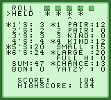

# Yatzy-GB

A version of the dice game Yatzy for the Nintendo Game Boy




## Running

Yatzy-GB should run in all emulators (I have yet to find any that don't) and,
though I haven't had a chance to try it out, I'm fairly confident it should work
on real hardware. If you do run into problems, feel free to make an issue.

A pre-built ROM is available in the releases tab.

## Rules & Controls

**DPAD** - Move the cursor (the `>` character)

**A**    - Press a button/Score a category/Toggle whether a die is held

Yatzy has rules similar to Yacht and Yahtzee. You roll five dice and can then
reroll some or all of them twice. To pick which dice to 'hold' on to (ie. not
reroll), move the cursor onto the hold button and press the A button to toggle
whether to hold the die above the hold cursor (the `^` character) that appears.
A star is displayed beneath dice you are holding.

Points are scored by matching different combinations - for instance, picking
the 3's category adds the sum of all the dice showing a 3 to your score. You
have to use a category once you've used both rerolls and can only use each
category once. A star is displayed next to categories you have already scored.

For a full ruleset and complete listing of categories, see the [Wikipedia page
for Yatzy](https://wikipedia.org/wiki/Yatzy).

## Building

Requires [RGBDS](https://github.com/gbdev/rgbds) to be installed and in your
`$PATH`. Built using v0.5.0 - older versions may work, but I haven't tested
them. The provided `Makefile` works on Linux, though I haven't had the chance
to test on either MacOS or Windows.

To build, run `make all` while in the repository root, the final ROM, `yatzy.gb`
will be in the `bin/` directory. `make clean` will remove the `bin/` directory
and `make run` will run the built ROM using an emulator.

The default emulator used by `make run` is
[Sameboy](https://github.com/LIJI32/SameBoy), though this can be configured to
be any command by changing line 15 in the `Makefile` or by specifying it in the
`make` command. The path of the ROM will be appended to the command specified.
For instance, to copy the built ROM into a different directory, change the
value in the `Makefile` to:

```
EMU	:= cp -t /path/to/roms
```

Or by specifying it in the `make` command:

```
make run EMU="cp -t /path/to/roms"
```

### Seeding the RNG

By default, the ROM built will seed the RNG used for dice values using the value
of DIV register when the player presses start. Alternatively, you can set a
constant seed so the same dice are always given in the same order. To do this,
set the `RNG` Makefile variable to a value other than the default of `-1`.
Running `make clean` will also likely be necessary to force a rebuild:

```
make clean; make RNG=27659
```

## Credits

`inc/hardware.inc`

Credit and thanks go to the GBDev community for this file. The original can be
found [here](https://github.com/gbdev/hardware.inc).

`src/core/rand.asm`
`src/core/bcd.asm`

Credit and thanks for both of these source files go to Damian Yerrick. I've made
no modifications other than to change the file ending from `.z80` to `.asm`.
The original files can be found
[here](https://github.com/pinobatch/240p-test-mini).

Many thanks to the GBDev community for all the great resources and tutorials.

